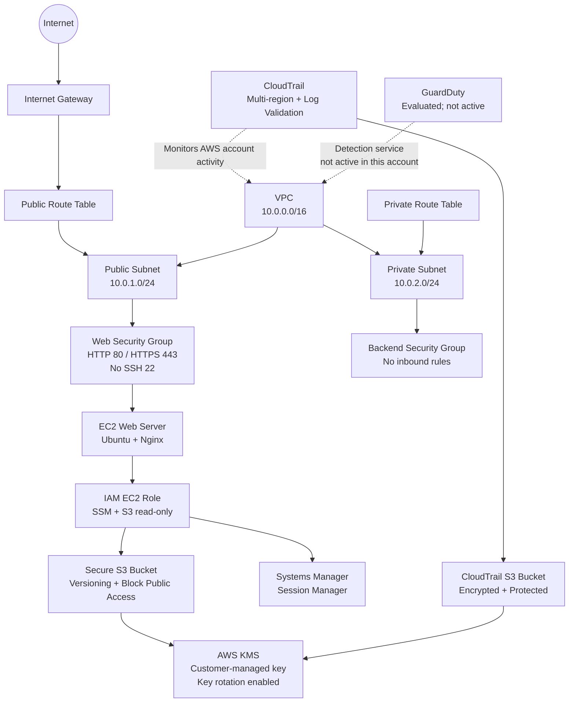

# Secure AWS Infrastructure Architecture

```mermaid
flowchart TB
    Internet((Internet))
    IGW[Internet Gateway]
    VPC["VPC<br/>10.0.0.0/16"]
    PublicRT["Public Route Table"]
    PublicSubnet["Public Subnet<br/>10.0.1.0/24"]
    WebSG["Web Security Group<br/>HTTP 80 / HTTPS 443<br/>No SSH 22"]
    EC2["EC2 Web Server<br/>Ubuntu + Nginx"]
    PrivateRT["Private Route Table"]
    PrivateSubnet["Private Subnet<br/>10.0.2.0/24"]
    BackendSG["Backend Security Group<br/>No inbound rules"]
    S3["Secure S3 Bucket<br/>Versioning + Block Public Access"]
    KMS["AWS KMS<br/>Customer-managed key<br/>Key rotation enabled"]
    IAM["IAM EC2 Role<br/>SSM + S3 read-only"]
    SSM["Systems Manager<br/>Session Manager"]
    CT["CloudTrail<br/>Multi-region + Log Validation"]
    CTBucket["CloudTrail S3 Bucket<br/>Encrypted + Protected"]
    GD["GuardDuty<br/>Evaluated; not active"]

    Internet --> IGW
    IGW --> PublicRT
    PublicRT --> PublicSubnet
    PublicSubnet --> WebSG
    WebSG --> EC2
    VPC --> PublicSubnet
    VPC --> PrivateSubnet
    PrivateRT --> PrivateSubnet
    PrivateSubnet --> BackendSG
    EC2 --> IAM
    IAM --> S3
    IAM --> SSM
    S3 --> KMS
    CT --> CTBucket
    CTBucket --> KMS
    CT -. "Monitors AWS account activity" .-> VPC
    GD -. "Detection service<br/>not active in this account" .-> VPC
```
